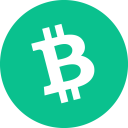
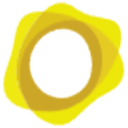

# Crypto Address Visualizer

Crypto Address Visualizer is a browser extension that gives you extra confidence when copy-pasting crypto wallet addresses between online crypto services by enabling you to compare addresses visually with multiple images.

**Supported browsers:**

 Chrome: *Support coming soon*  \
 Edge: *Support coming soon*  \
 Brave: *Support coming soon*  \
 Vivaldi: *Support coming soon*  \
 Opera: *Support coming soon*  \
 Firefox: *Support coming when Firefox supports [Manifest v3](https://blog.mozilla.org/addons/2021/05/27/manifest-v3-update/)*

## Overview

...

## Visualizations

...

## Privacy & Security

The following steps have been taken to maximize privacy and security when using this extension:

1. **This extension is fully open source**

    The full source code for this extension is available in the [crypto-address-visualizer repository](https://github.com/schmich/crypto-address-visualizer/tree/master/src).

2. **This extension has no tracking, analytics, or cookies**

    This extension has no ads, no tracking, no analytics, and no cookies.

3. **This extension cannot make external requests**

    Due to a very strict [content security policy](https://developers.google.com/web/fundamentals/security/csp), this extension *cannot* make external requests, so it cannot send information to or receive information from any external service. See `content_security_policy` in [manifest.json](src/manifest.json).

4. **This extension does not import any external assets**

    JS, CSS

5. **This extension has no library references or dependencies**

    All required source has been copied.

6. **All loaded assets have subresource integrity checksums**

    SRI, link to visualizer.html

7. **This extension runs fully offline**

    This extension is [offline enabled](https://developer.chrome.com/docs/apps/manifest/offline_enabled/) and does not need internet connectivity to function. See `offline_enabled` in [manifest.json](src/manifest.json).

8. **This extension only requires one single permission**

    Browser extensions must [declare all permissions](https://developer.chrome.com/docs/extensions/mv3/declare_permissions/) necessary to function. This extension only requires the [contextMenus permission](https://developer.chrome.com/docs/extensions/reference/contextMenus/), meaning its scope and capabilities are extremely limited. See `permissions` in [manifest.json](src/manifest.json).

9. **This extension cannot read or edit content on any page**

    Related to the previous point, due to permissions limitations, this extension cannot read or edit content on any page you visit. It has no access to your user profile or any of your personal data, public or private. It *only* has access to the text you select and provide to it through the context menu.

10. **This extension does not store any data**

    This extension does not use local storage or any extension storage of any kind.

## Donate

This extension is free forever. Donations are appreciated.

    

         Bitcoin: 3AMquLosfN95B7znVX4JSMTwrbps7FegKc
    

    

    

         Ethereum: 0xDb3D8798Ac8D0Db0BF16ACd6F536fC9634253b9C
    

    

    

         USD Coin: 0x43f039Ec812a3f6b9e649853244637F1CBF85Ffa
    

    

    

         Litecoin: MUnX5iwLDsgfh9YmJAZp3MJ8MfMiGKb7aB
    

    

    

         Cardano: addr1v8wa2e0u53g5j3ay0zjuq6pysmdj2gtyjzhqtadduv87q5gss9nxg
    

    

    

         Bitcoin Cash: 14QnKWFsuZwbDAc6LgSF8kjThYLwuHRJ2C
    

    

    

         Dogecoin: DP9rhCR4E8qQrfadfRtuc9vTimUrZBb2Zr
    

    

    

         Polkadot: 15yNgRV9quNLqfdGcX3y3yb2zXebiW4Dpjb6MaWgCQgW2A32
    

    

    

         Solana: G3MgYuKqcXwHkC5iFFfujxihqqXEoeA4H3r3YFyUBZWq
    

    

    

         Algorand: YTJYE4ZBUWWGO7JQOSO44JZJV7QZJFLEFWDXDWV3AAF3NW3Z44GSPXKPWQ
    

    

    

         Tezos: tz1Sc1j1wnT6fmLDiBCdCZ4D4y7MrZFQogGa
    

    

    

         Maker: 0x09e1FF58c527041d73535617b989C27a3787E992
    

    

    

         Aave: 0x01BAF46136d52Ce62dc02B84A740d32C8D5251B8
    

    

    

         Polygon: 0xB3F205611acE0a660bCe412C38E58a910BED0e01
    

    

    

         Dai: 0xaE396fc1Ccc3CA7b64F1639826a6988Cc55F797e
    

    

    

         TRON: TWJmsiCRizDMBWdV1oWr3QwKbXRW6cb66q
    

    

    

         PAX Gold: 0x29F8fBE57aF96EDffd066860458601eaB1a82Ff5
    

    

    

         SushiSwap: 0xBfAaad6B5CDdD575e6B9ACB492De3580ac837DDc
    

    

    

         Uniswap: 0x7e48aaC89e8b5367BA66F21A6776bF35cEA19C84
    

    

    

         Compound: 0xddEB2A399fD0bB74E405dc1943E204c3c4003B68
    

    

    

         Basic Attention Token: 0x9C0dE3f9bFBf2a65Bf83DCcc0FE3780fFdba2807
    

    

    

         The Graph: 0x0792bFD809d5cc7828C99703376d882E7Edcb6eB
    

    

    

         Chainlink: 0xDb31EF2C481CBbBd38c0404152e3199C6fD287A7
    

    

    

         NuCypher: 0x97c43c0226006073788e1E769B6685FD20D77bf8
    

    

    

         Tether: 0xfaf5656af896C6c43C2f1689A15843ca2b07DEA7
    

    

## License

Copyright &copy; 2021 Chris Schmich  \
MIT License. See [LICENSE](LICENSE) for details.