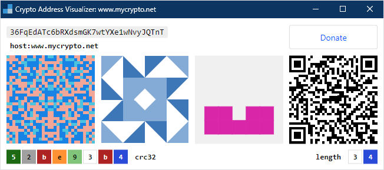

# Crypto Address Visualizer

Crypto Address Visualizer is a browser extension that gives you extra confidence when copy-pasting crypto wallet addresses between online crypto services by enabling you to compare addresses visually with multiple images.

## Installation

Install the extension for your browser:

 Chrome: [Install extension](https://chrome.google.com/webstore/detail/crypto-address-visualizer/fbobbccllnpjhnmhaekkggngkomifhhp/)  \
 Edge: *Support coming soon*  \
 Brave: *Support coming soon*  \
 Vivaldi: *Support coming soon*  \
 Opera: *Support coming soon*  \
 Firefox: *Support coming when Firefox supports [Manifest v3](https://blog.mozilla.org/addons/2021/05/27/manifest-v3-update/)*

## Quick Start

**Select your crypto wallet address text on any website**

**Right-click and select _Crypto Address Visualizer_**

**Repeat across websites and compare images and checksums to ensure addresses are the same**

## Privacy & Security

The following steps have been taken to maximize privacy and security when using this extension:

1. **This extension is fully open source**

    The full source code for this extension is available in the [crypto-address-visualizer repository](https://github.com/schmich/crypto-address-visualizer/tree/master/src).

1. **This extension _cannot_ make external requests**

    Due to a very strict [content security policy](https://developers.google.com/web/fundamentals/security/csp), this extension *cannot* make external requests, so it cannot send information to or receive information from any external service. See `content_security_policy` in [manifest.json](src/manifest.json).

1. **This extension only requires one single permission**

    Browser extensions must [declare all permissions](https://developer.chrome.com/docs/extensions/mv3/declare_permissions/) necessary to function. This extension only requires the [contextMenus permission](https://developer.chrome.com/docs/extensions/reference/contextMenus/), meaning its scope and capabilities are extremely limited. See `permissions` in [manifest.json](src/manifest.json).

1. **This extension _cannot_ read or edit content on any page**

    Related to the previous point, due to permissions limitations, this extension cannot read or edit content on any page you visit. It has no access to your user profile or any of your personal data, public or private. It has no access to your clipboard.

    It *only* has access to the text you select and provide to it through the context menu.

1. **This extension has zero tracking, zero analytics, and zero cookies**

    No Google Analytics. No social media tracking. No marketing pixels. Nothing.

1. **This extension runs fully offline**

    This extension is [offline enabled](https://developer.chrome.com/docs/apps/manifest/offline_enabled/) and does not need internet connectivity to function. See `offline_enabled` in [manifest.json](src/manifest.json).

1. **This extension does not store any data**

    This extension does not use local storage or extension storage of any kind. Nothing is saved to or loaded from disk. This extension operates entirely in memory.

1. **This extension does not import any external assets**

    All assets (HTML, CSS, JavaScript, images) are packaged and included with the extension at the time of publishing. No external assets are requested or included at runtime.

1. **All loaded assets have subresource integrity checksums**

    All assets loaded in the visualizer are protected with [subresource integrity](https://developer.mozilla.org/en-US/docs/Web/Security/Subresource_Integrity) to ensure they were not manipulated or tampered with between development, packaging, distribution, installation, and runtime. See [visualizer.html](src/visualizer.html) for details.

## Donate

Crypto Address Visualizer is free forever. Donations are appreciated.

    

         Bitcoin
    

     3AMquLosfN95B7znVX4JSMTwrbps7FegKc
      

    

         Ethereum
    

     0xDb3D8798Ac8D0Db0BF16ACd6F536fC9634253b9C
      

    

         USD Coin
    

     0x43f039Ec812a3f6b9e649853244637F1CBF85Ffa
      

    

         Litecoin
    

     MUnX5iwLDsgfh9YmJAZp3MJ8MfMiGKb7aB
      

    

         Cardano
    

     addr1v8wa2e0u53g5j3ay0zjuq6pysmdj2gtyjzhqtadduv87q5gss9nxg
      

    

         Bitcoin Cash
    

     14QnKWFsuZwbDAc6LgSF8kjThYLwuHRJ2C
      

    

         Dogecoin
    

     DP9rhCR4E8qQrfadfRtuc9vTimUrZBb2Zr
      

    

         Polkadot
    

     15yNgRV9quNLqfdGcX3y3yb2zXebiW4Dpjb6MaWgCQgW2A32
      

    

         Solana
    

     G3MgYuKqcXwHkC5iFFfujxihqqXEoeA4H3r3YFyUBZWq
      

    

         Algorand
    

     YTJYE4ZBUWWGO7JQOSO44JZJV7QZJFLEFWDXDWV3AAF3NW3Z44GSPXKPWQ
      

    

         Tezos
    

     tz1Sc1j1wnT6fmLDiBCdCZ4D4y7MrZFQogGa
      

    

         Maker
    

     0x09e1FF58c527041d73535617b989C27a3787E992
      

    

         Aave
    

     0x01BAF46136d52Ce62dc02B84A740d32C8D5251B8
      

    

         Polygon
    

     0xB3F205611acE0a660bCe412C38E58a910BED0e01
      

    

         Dai
    

     0xaE396fc1Ccc3CA7b64F1639826a6988Cc55F797e
      

    

         TRON
    

     TWJmsiCRizDMBWdV1oWr3QwKbXRW6cb66q
      

    

         PAX Gold
    

     0x29F8fBE57aF96EDffd066860458601eaB1a82Ff5
      

    

         SushiSwap
    

     0xBfAaad6B5CDdD575e6B9ACB492De3580ac837DDc
      

    

         Uniswap
    

     0x7e48aaC89e8b5367BA66F21A6776bF35cEA19C84
      

    

         Compound
    

     0xddEB2A399fD0bB74E405dc1943E204c3c4003B68
      

    

         Basic Attention Token
    

     0x9C0dE3f9bFBf2a65Bf83DCcc0FE3780fFdba2807
      

    

         The Graph
    

     0x0792bFD809d5cc7828C99703376d882E7Edcb6eB
      

    

         Chainlink
    

     0xDb31EF2C481CBbBd38c0404152e3199C6fD287A7
      

    

         NuCypher
    

     0x97c43c0226006073788e1E769B6685FD20D77bf8
      

    

         Tether
    

     0xfaf5656af896C6c43C2f1689A15843ca2b07DEA7
      

## License

Copyright &copy; 2021 Chris Schmich  \
MIT License. See [LICENSE](LICENSE) for details.